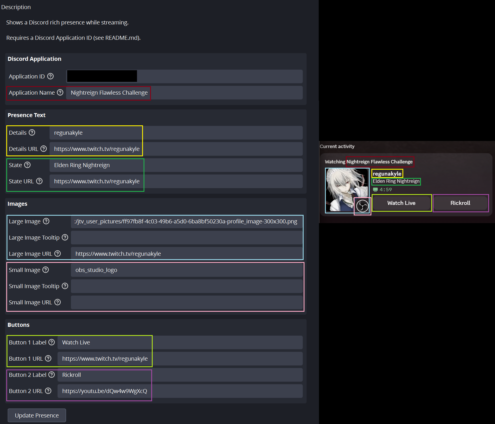

# OBS Discord Rich Presence

> **Origin note:** this project is mostly LLM-generated, written with human guidance (requirements, decisions, and review).

An [OBS Studio](https://obsproject.com) Python script that shows a **Discord rich presence while you are streaming**.
The presence starts when you start streaming and stops when you stop.

The script talks to your locally running Discord client over its IPC pipe using the bundled, self-contained [pypresence](https://github.com/qwertyquerty/pypresence) library.
You only need to install Python to use this script.

## Features

- Starts/stops automatically with your stream.
- Shows elapsed streaming time (Discord's timer).
- Almost all presence fields are configurable in the OBS scripts window.

## Requirements

> **Platform note:** This script has only been tested on Windows with Python 3.12. It may or may not work on Linux and macOS.

- OBS Studio 29.1 or newer.
- Windows with the **Discord desktop app** running while you stream.
- A Python installation for OBS scripting.

  Any Python version between 3.9 to 3.12 should work.

  Python 3.12 can be downloaded [here](https://www.python.org/downloads/release/python-31210/) (Remember to tick *Add python.exe to PATH*).

## Setup

### 1. Create a Discord application

1. Go to the [Discord Developer Portal](https://discord.com/developers/applications).
2. Click **New Application**, give it a name and save.
3. On the **General Information** page, copy the **Application ID**.

**Optional**: for a custom large/small image, go to **Rich Presence → Art Assets** in the portal and upload images, then use their **asset keys** as the image fields in the script. Image URLs also work.

### 2. Add the script to OBS

1. Download the [release archive](https://github.com/regunakyle/obs-discord-rich-presence/releases) and unzip it anywhere you like.
2. In OBS, open **Tools → Scripts**.
3. On the **Python Settings** tab, set the Python install path, for example `C:\Users\<Username>\AppData\Local\Programs\Python\Python312` (There should be a `python3.dll` file inside the folder).
4. On the **Scripts** tab, click **+** and select `obs_discord_rich_presence.py`.

### 3. Configure the script

With the script selected, fill in the settings:

| Setting | Meaning | Suggested Value |
| --- | --- | --- |
| Discord Application ID | (REQUIRED) The Application ID from [step 1](#1-create-a-discord-application) | |
| Application Name | Optional app name override; Discord uses the app name as defined in Developer Portal if this field is not set | Your stream title |
| Details | First line of the presence | Your channel name |
| Details URL | Link opened when clicking the details text | URL of your channel |
| State | Second line of the presence | |
| State URL | Link opened when clicking the state text | |
| Large Image (key or URL) | Large profile image: an art asset key or a direct image URL | URL/Key of your channel icon |
| Large Image Tooltip | Text shown when hovering the large image | |
| Large Image URL | Link opened when clicking the large image | URL of your channel |
| Small Image (key or URL) | Small corner image: an art asset key or a direct image URL | URL/Key of OBS Studio icon |
| Small Image Tooltip | Text shown when hovering the small image | |
| Small Image URL | Link opened when clicking the small image | |
| Button 1 Label | Label of the first clickable button under the presence | `Watch Live` |
| Button 1 URL | Link opened when the viewer clicks the first button | URL of your channel |
| Button 2 Label | Label of the second clickable button | |
| Button 2 URL | Link opened when the viewer clicks the second button | |

Empty fields are simply left out of the presence. A button is only shown when both its label and URL are set.

**(NOTE: You cannot see the buttons in your own rich presence. Check the buttons with another account)**

The settings are stored locally, updated as you type.

However, modified settings are not automatically pushed to Discord: you need to press the `Update Presence` button after you modify the settings while streaming.

## Troubleshooting

All messages appear either in the script log at the bottom of the Scripts window  in the main OBS log file (`Tools → Log Files`).

- **Nothing happens:** check the script log for warnings. The most common cause is a missing or wrong Application ID — the script shows a warning in its settings while the Application ID is empty (OBS 29.1+).
- **`Could not connect to Discord (...)`:** make sure the Discord desktop app is running and logged in. The script keeps retrying.
- **Script does not load at all:** the Python path in the Scripts window is wrong, missing, or has the wrong architecture (64-bit OBS needs 64-bit Python).

## License

This script is licensed under the **GNU General Public License v3**; see [LICENSE.md](./LICENSE.md).

`pypresence` is bundled unmodified and is licensed under the MIT license; its license text is included as `pypresence/LICENSE`.
